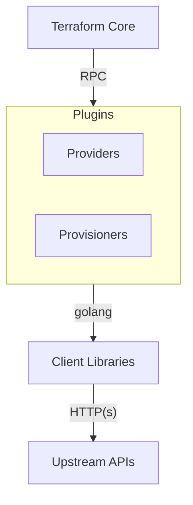

# Introduction
## Background
Traditionally, to manage a piece of infrastructure hosted in a cloud provider, we would have to log into an administrative portal/console, and manually provision that infrastructure resource. This is fine if there are not a lot of resources to manage.

As the project gets more complex, there would be higher volatility in the infrastructure changes. For example, to scale up infrastructure for a peak day, sunsetting legacy infrastructures, etc. Managing infrastructure manually starts to get challenging as there are many changes to make.

## What is IaC?
Infrastructure as Code (IaC) is the idea of using code to create configuration files for managing a software infrastructure. By specifying infrastructure requirements and dependencies as code, we can then version, automate and release the changes on the infrastructure.  

## What is Terraform?
Terraform is an open source Infrastructure as Code tool to automate the provisioning and management of Cloud infrastructures. The configuration files are written in the **HashiCorp Configuration Language(HCL)**. This language is written in `.tf` files. 

## Terraform Architechture

Terraform is mainly split into several parts:

**Terraform Core:** This is the binary that communicates with Terraform plugins to manage the infrastructure. It is responsible for reading configuration files, building the dependency graph and communicating with plugins over RPC.

**Terraform Plugins:** Plugins are executable binaries written in Go. Currently, there are 2 kinds of plugins: Providers and Provisioners. Providers expose implementations to services such as AWS, AzureRM. Provisioners run scripts during resource creation or destruction.

**Client Libraries:** Client libraries make it easier to communicate with services from a supported language. While it is possible to call the services' API directly, client libraries simplify the code you need to call them

## Terraform Workflow
The workflow for using Terraform consists of five stages: **Write, Initialisation, Plan, Apply/Destroy**

**Writing Terraform configuration files**

Writing the configuration files is the first step of using Terraform. The working directory should have at least include one `.tf` file written using HCL. 

Several common practices when writing the config files are:
1. Store your config files in version control and make small incremental changes to them as you write them.
1.  Repeatedly run commands `terraform init` or `terraform plan` to check and fix the syntax errors.

**Initialization** 

When `terraform init` command is executed, Terraform Core reads the configuration files in the working directory, downloads the plugins from several sources,  and generates a lock file for subsequent `terraform init` executions to decide which plugin versions to be used. 
